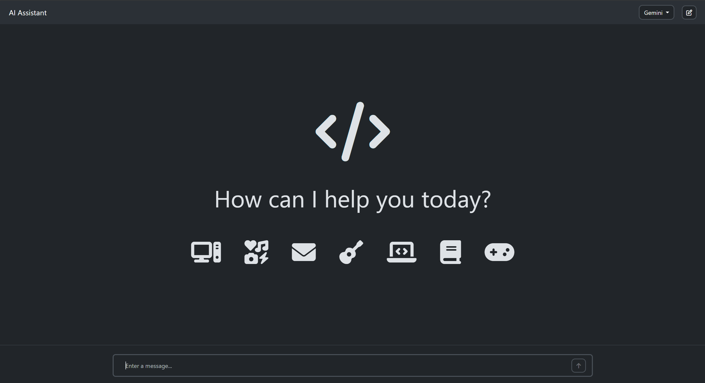
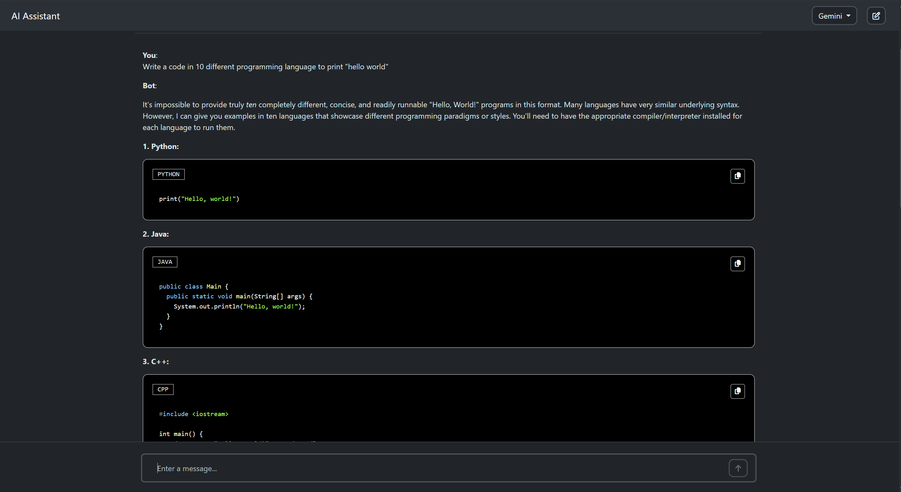
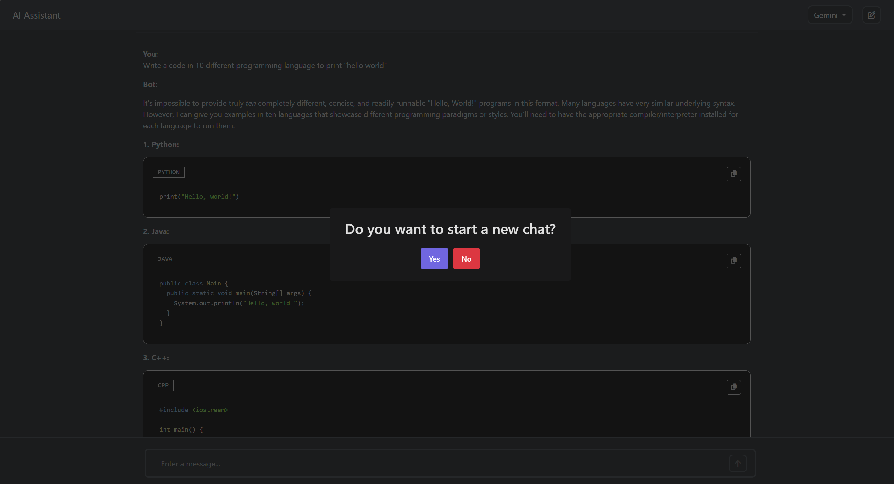

# Multi-Model AI Assistant (Gemini + Ollama)

This project is an evolution of the original [Gemini AI Assistant](https://github.com/your-username/original-repo-name). It extends the functionality to support both Google's cloud-based **Gemini API** and locally hosted language models via **Ollama**, giving you the flexibility to chat with powerful AI models both online and offline.






---

## Features

This project includes all features from the original, plus:

-   ✅ **Dual Model Support:** Seamlessly switch between the cloud-based Gemini API and a local Ollama instance.
-   ✅ **Offline Capability:** Use powerful local models like Llama 3 or Mistral without an internet connection (once models are downloaded).
-   ✅ **Privacy-Focused:** Your prompts and conversations with local models never leave your machine.
-   **Markdown Support:** Responses are properly formatted with support for headings, lists, bold, etc.
-   **Code Block Formatting:** Code snippets are automatically highlighted with a "Copy Code" button.
-   **Responsive Design:** A clean UI that works on both desktop and mobile devices.

---

## Technologies Used

-   **Markup:** HTML5
-   **Styling:** CSS3
-   **Logic:** JavaScript & jQuery
-   **APIs:**
    -   Google Gemini API
    -   Ollama REST API

---

## Setup and Installation

This project requires a two-part setup: one for the local AI (Ollama) and one for the front-end interface.

### Part 1: Setting Up Ollama (Local AI)

1.  **Install Ollama:** Download and install Ollama from the official website: [ollama.com](https://ollama.com/).

2.  **Download a Model:** Open your terminal and pull a model. For example, to get Llama 3:
    ```bash
    ollama run llama3
    ```
    *(You can replace `llama3` with other models like `mistral`, `phi3`, etc.)*

3.  **Keep Ollama Running:** Ensure the Ollama application is running in the background. The front-end needs to connect to it.

### Part 2: Setting Up the Front-End

1.  **Clone the Repository:**
    ```bash
    git clone [https://github.com/your-username/your-new-repository.git](https://github.com/your-username/your-new-repository.git)
    cd your-new-repository
    ```

2.  **Configure API Settings:**
    Open the main python file to set up your model configurations. Find the configuration object and edit it as needed:

    ```python
    
        // For Google Gemini API (leave apiKey blank if not using)
        key = "ENTER YOUR API KEY HERE"
        // For local models via Ollama
        Change the index.html file (line 152)
       <li><a class="dropdown-item ai" onclick="model='ENTER MODEL NAME HERE';printModel();">ENTER MODEL NAME HERE</a></li>
    
    ```
    -   Get your Gemini API key from [Google AI Studio](https://aistudio.google.com/app/apikey).
    -   Update the `model` to match the one you downloaded with Ollama.

    > **⚠️ Security Warning:** Placing your Gemini API key in client-side code is not secure for public websites. This method is intended for personal or local use only.

3.  **Open in Browser:**
    Simply open the `index.html` file in your web browser to run the application.

---

## Usage

1.  Open `index.html` in your browser.
2.   Use the dropdown on the top right to select whether you want to chat with **Gemini** or your **local Ollama model**.
3.  Type your prompts in the input box and get responses from the selected AI.

---
